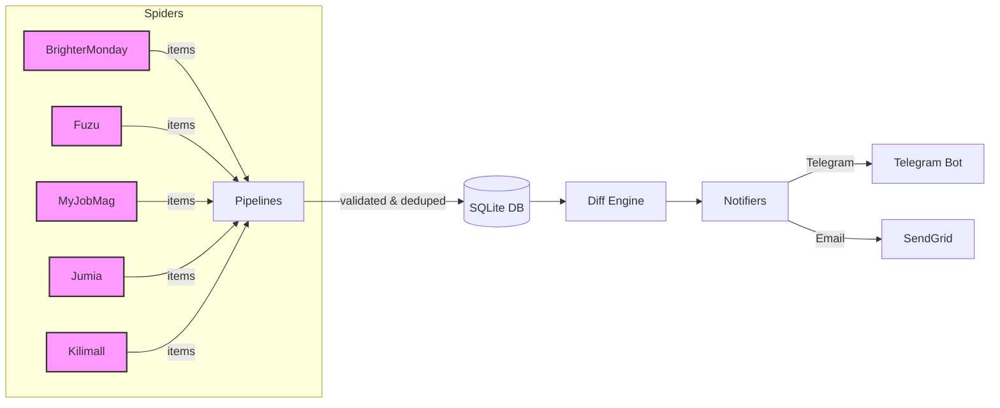

# Angalia Scraper

[](https://github.com/yourorg/angalia-scraper/actions)
[](https://www.python.org/downloads/)
[](LICENSE)

> Ethical scraper that monitors Kenyan job boards and e‑commerce sites,
> storing changes in SQLite and notifying via Telegram and email.

## Table of Contents

- [Architecture](#architecture)
- [Quick start (Docker)](#quick-start-docker)
- [Configuration](#configuration)
- [Adding a new spider](#adding-a-new-spider)
- [Rate‑limit table](#rate‑limit-table)
- [Ethics & Legal](#ethics--legal)
- [Sample JSON output](#sample-json-output)
- [Tests](#tests)

## Architecture



*Spiders scrape → Pipelines clean → SQLite persists → DiffEngine detects changes → Notifiers push alerts.*

## Quick start (Docker)

```bash
# 1️⃣ Clone the repo
git clone https://github.com/yourorg/angalia-scraper.git
cd angalia-scraper

# 2️⃣ Copy env example & edit secrets
cp .env.example .env
# Edit .env with real tokens / keys

# 3️⃣ Build & run containers
docker-compose up -d

# 4️⃣ Check logs
docker-compose logs -f
```

The Celery beat scheduler will automatically start scraping jobs (every 4 h) and products (every 6 h), dispatch Telegram alerts every 5 min, and send a daily email digest at **08:00 EAT** (05:00 UTC).

## Configuration

| Variable | Description | Example |
|----------|-------------|---------|
| `PROXY_LIST` | Comma‑separated list of HTTP proxies for rotating‑proxy middleware. | `http://proxy1:3128,http://proxy2:3128` |
| `ROBOTSTXT_OBEY` | Respect `robots.txt` (default `true`). | `true` |
| `TELEGRAM_BOT_TOKEN` | Bot token from BotFather. | `123456:ABC-DEF1234ghIkl-zyx57W2v1u123ew11` |
| `TELEGRAM_CHAT_ID` | Destination chat/user ID. | `-1001234567890` |
| `SENDGRID_API_KEY` | API key for SendGrid. | `SG.xxxxxxx` |
| `EMAIL_FROM` | Sender address for digests. | `alerts@angalia.io` |
| `EMAIL_TO` | Recipient address. | `user@example.com` |
| `SQLITE_DB_PATH` | SQLite DSN (mounted volume). | `sqlite:///data/angalia.db` |

### `config/watchlist.yaml`

```yaml
jumia:
  - https://www.jumia.co.ke/p/phone-iphone-13-pro-max-512gb-blue-5555555
  - https://www.jumia.co.ke/p/smart-tv-55-inch-samsung-123456
  - https://www.jumia.co.ke/p/laptop-dell-xps-13-789012
kilimall:
  - https://www.kilimall.co.ke/p/iphone-13-pro-max-512gb-blue-111111
  - https://www.kilimall.co.ke/p/sony-55-inch-smart-tv-222222
  - https://www.kilimall.co.ke/p/dell-xps-13-laptop-333333
```

## Adding a new spider

1. **Create module**: `angalia/spiders/<new_name>.py`.
2. **Define spider class** inheriting `scrapy.Spider` with:
   - `name = "<new_name>"`
   - `allowed_domains = [...]`
   - `start_urls = [...]`
   - a `custom_settings` dict (copy the pattern from existing spiders).
3. **Implement `parse`** to yield either:
   - follow links to detail pages,
   - or directly `yield ItemClass(...)`.
4. **Add to `run_spider`** in `angalia/tasks.py` under the appropriate group.
5. **Write tests** in `tests/test_spiders.py` using `responses` or Scrapy contracts.
6. **Update documentation** in this README (new source, rate‑limit entry).

## Rate‑limit table

| Source          | Max concurrent requests | Download delay | Autothrottle target |
|-----------------|------------------------|---------------|---------------------|
| BrighterMonday  | 1 per domain           | 2 s           | 1.0                 |
| Fuzu            | 1 per domain           | 2 s           | 1.0                 |
| MyJobMag        | 1 per domain           | 2 s           | 1.0                 |
| Jumia           | 1 per domain           | 2 s           | 1.0                 |
| Kilimall        | 1 per domain           | 2 s           | 1.0                 |

*All spiders share the global `DOWNLOAD_DELAY = 2` and `AUTOTHROTTLE_ENABLED = True`. Rotating proxies and random user‑agents provide additional anonymity.*

## Ethics & Legal

- **Robots.txt:** Honored by default (`ROBOTSTXT_OBEY=true`). Can be overridden via env var **ONLY** for internal testing.
- **Rate‑limiting:** Configured per‑domain (see table) plus a 2 s static delay.
- **Identifiable User‑Agent:** Scrapy‑user‑agents provides realistic strings; you may customise via `USER_AGENT_LIST`.
- **Respectful scraping:** No aggressive parallelism, no credential‑scraping, no DoS.

## Sample JSON output (one product)

```json
{
  "source": "jumia",
  "external_id": "5555555",
  "url": "https://www.jumia.co.ke/p/phone-iphone-13-pro-max-512gb-blue-5555555",
  "scraped_at": "2026-10-02T12:34:56.789012",
  "content_hash": "8f3e2c71e2d9c5b2a1f6d9d3d8a5e4c7b9f0a1b2c3d4e5f6a7b8c9d0e1f2a3b4",
  "name": "iPhone 13 Pro Max 512GB – Blue",
  "price": 149999.0,
  "currency": "KES",
  "in_stock": true,
  "rating": 4.6
}
```

## Tests

### `tests/fixtures/brighter_monday.html`

```html
<!doctype html>
<html>
<head><title>BrighterMonday Jobs</title></head>
<body>
  <div class="job-card">
    <a href="/jobs/12345" class="job-card">Software Engineer</a>
  </div>
  <a class="pagination-next" href="/jobs?page=2">Next</a>
</body>
</html>
```

### `tests/fixtures/fuzu.html`

```html
<!doctype html>
<html>
<head><title>Fuzu Jobs</title></head>
<body>
  <article class="job-card">
    <a href="/job/98765">Data Analyst</a>
  </article>
  <a rel="next" href="/jobs?page=2">Next</a>
</body>
</html>
```

### `tests/fixtures/myjobmag.html`

```html
<!doctype html>
<html>
<head><title>MyJobMag</title></head>
<body>
  <div class="job-listing">
    <a class="title" href="/jobs/55555">Product Manager</a>
  </div>
  <ul class="pagination"><li class="next"><a href="/jobs?page=2">Next</a></li></ul>
</body>
</html>
```

### `tests/fixtures/jumia_product.html`

```html
<!doctype html>
<html>
<head><title>Jumia Product</title></head>
<body>
  <h1 class="-fs20 -pts -pbxs">iPhone 13 Pro Max 512GB – Blue</h1>
  <span class="-b -ltr -tal -prc">KSh 149,999</span>
  <span class="-fs14 -p -b -trc">In stock</span>
  <span class="-fs12 -pts" title="4.6 out of 5"></span>
</body>
</html>
```

### `tests/fixtures/kilimall_product.html`

```html
<!doctype html>
<html>
<head><title>Kilimall Product</title></head>
<body>
  <h1 class="prod-title">iPhone 13 Pro Max 512GB – Blue</h1>
  <span class="curr-price">KSh 152,000</span>
  <div class="availability"><span>In stock</span></div>
  <div class="rating"><span data-rating="4.5"></span></div>
</body>
</html>
```

### `tests/test_spiders.py`

```python
import datetime
from pathlib import Path
import pytest
from scrapy.http import HtmlResponse, Request
from angalia.spiders.brighter_monday import BrighterMondaySpider
from angalia.spiders.fuzu import FuzuSpider
from angalia.spiders.myjobmag import MyJobMagSpider
from angalia.spiders.jumia import JumiaSpider
from angalia.spiders.kilimall import KilimallSpider

FIXTURE_DIR = Path(__file__).parent / "fixtures"

def _load_fixture(name):
    return (FIXTURE_DIR / name).read_text(encoding="utf-8")

@pytest.fixture
def dummy_spider():
    class DummyCrawler:
        def __init__(self):
            self.stats = {}
    class Dummy:
        crawler = DummyCrawler()
    return Dummy()

def test_brighter_monday_parse():
    html = _load_fixture("brighter_monday.html")
    resp = HtmlResponse(url="https://www.brightermonday.com/jobs", body=html, encoding="utf-8")
    spider = BrighterMondaySpider()
    results = list(spider.parse(resp))
    assert any(isinstance(r, Request) for r in results)

def test_fuzu_parse():
    html = _load_fixture("fuzu.html")
    resp = HtmlResponse(url="https://www.fuzu.com/jobs", body=html, encoding="utf-8")
    spider = FuzuSpider()
    results = list(spider.parse(resp))
    assert any(isinstance(r, Request) for r in results)

def test_myjobmag_parse():
    html = _load_fixture("myjobmag.html")
    resp = HtmlResponse(url="https://www.myjobmag.co.ke/jobs", body=html, encoding="utf-8")
    spider = MyJobMagSpider()
    results = list(spider.parse(resp))
    assert any(isinstance(r, Request) for r in results)

def test_jumia_parse_product():
    html = _load_fixture("jumia_product.html")
    resp = HtmlResponse(url="https://www.jumia.co.ke/p/phone-iphone-13-pro-max-512gb-blue-5555555", body=html, encoding="utf-8")
    spider = JumiaSpider()
    items = list(spider.parse_product(resp))
    assert len(items) == 1
    item = items[0]
    assert item.name == "iPhone 13 Pro Max 512GB – Blue"
    assert item.price == 149999.0
    assert item.in_stock is True

def test_kilimall_parse_product():
    html = _load_fixture("kilimall_product.html")
    resp = HtmlResponse(url="https://www.kilimall.co.ke/p/iphone-13-pro-max-512gb-blue-111111", body=html, encoding="utf-8")
    spider = KilimallSpider()
    items = list(spider.parse_product(resp))
    assert len(items) == 1
    item = items[0]
    assert item.name == "iPhone 13 Pro Max 512GB – Blue"
    assert item.price == 152000.0
    assert item.in_stock is True
```

### `tests/test_diff_engine.py`

```python
import datetime
import pytest
from angalia.diff.engine import diff
from angalia.items import ProductItem

def make_item(price):
    return ProductItem(
        source="jumia",
        external_id="123",
        url="https://example.com/item/123",
        scraped_at=datetime.datetime.utcnow(),
        name="Test Product",
        price=price,
        currency="KES",
        in_stock=True,
        rating=4.5,
    )

def test_price_drop():
    old = make_item(150000)
    new = make_item(140000)
    events = diff(old, new)
    assert len(events) == 1
    ev = events[0]
    assert ev["type"] == "PRICE_DROP"
    assert ev["old"] == 150000
    assert ev["new"] == 140000

def test_price_rise():
    old = make_item(100000)
    new = make_item(110000)
    events = diff(old, new)
    assert events[0]["type"] == "PRICE_RISE"

def test_no_change():
    old = make_item(200000)
    new = make_item(200000)
    events = diff(old, new)
    assert events == []
```

### `tests/test_pipelines.py`

```python
import datetime
import json
import pytest
from angalia.pipelines import ValidationPipeline, DeduplicationPipeline, SQLiteStorePipeline, DiffPipeline
from angalia.items import JobItem
from angalia.storage.db import get_session, engine
from angalia.storage.models import Item

# Use in‑memory SQLite for tests
engine.url = "sqlite:///:memory:"

@pytest.fixture
def sample_job():
    return JobItem(
        source="brightermonday",
        external_id="job-001",
        url="https://example.com/job/001",
        scraped_at=datetime.datetime.utcnow(),
        title="DevOps Engineer",
        company="Acme Corp",
        location="Nairobi",
        job_type="Full‑time",
        salary="KES 200k",
        posted_at=datetime.datetime.utcnow(),
        description_snippet="Exciting role...",
    )

def test_validation_pipeline(sample_job):
    p = ValidationPipeline()
    assert p.process_item(sample_job, spider=type("S", (), {"name": "test"})) == sample_job

def test_deduplication_pipeline(sample_job, monkeypatch):
    # Insert a duplicate record
    with get_session() as session:
        session.add(
            Item(
                source=sample_job.source,
                external_id=sample_job.external_id,
                url=sample_job.url,
                data=json.dumps(sample_job.__dict__),
                content_hash=sample_job.content_hash,
                first_seen=datetime.datetime.utcnow(),
                last_seen=datetime.datetime.utcnow(),
            )
        )
        session.commit()
    p = DeduplicationPipeline()
    with pytest.raises(Exception) as exc:
        p.process_item(sample_job, spider=type("S", (), {"name": "test"}))
    assert "Duplicate content_hash" in str(exc.value)

def test_sqlite_store_pipeline(sample_job):
    p = SQLiteStorePipeline()
    item = p.process_item(sample_job, spider=type("S", (), {"name": "test"}))
    with get_session() as session:
        stored = session.query(Item).filter_by(source=sample_job.source, external_id=sample_job.external_id).one()
        assert stored is not None
        loaded = json.loads(stored.data)
        assert loaded["title"] == "DevOps Engineer"

def test_diff_pipeline(sample_job):
    diff_pipe = DiffPipeline()
    dummy_spider = type("Spider", (), {"crawler": type("C", (), {"stats": type("S", (), {"inc_value": lambda *a, **k: None, "get_value": lambda *a, **k: [], "set_value": lambda *a, **k: None})()})()})
    diff_pipe.process_item(sample_job, dummy_spider)
    # Simulate an update
    sample_job.salary = "KES 210k"
    diff_pipe.process_item(sample_job, dummy_spider)
    events = dummy_spider.crawler.stats.get_value("change_events_list")
    assert len(events) >= 2
    assert any(ev["type"] == "NEW" for ev in events)
    assert any(ev["type"] == "UPDATED" and ev["field"] == "salary" for ev in events)
```

### `tests/test_notifiers.py`

```python
import asyncio
import pytest
from angalia.notify.telegram import format_event, _send_message
from angalia.notify.email import render_html, send_email_digest

@pytest.mark.asyncio
async def test_format_event():
    ev = {
        "type": "PRICE_DROP",
        "source": "jumia",
        "field": "price",
        "old": 150000,
        "new": 140000,
        "url": "https://example.com/item/1",
    }
    txt = format_event(ev)
    assert "📉" in txt
    assert "[JUMIA]" in txt
    assert "*150000 → 140000*" in txt

def test_render_email_html():
    events = [
        {
            "type": "NEW",
            "source": "fuzu",
            "field": None,
            "old": None,
            "new": {"title": "Data Analyst"},
            "url": "https://fuzu.com/job/123",
        },
        {
            "type": "PRICE_DROP",
            "source": "jumia",
            "field": "price",
            "old": 150000,
            "new": 140000,
            "url": "https://jumia.co.ke/p/1",
        },
    ]
    html = render_html(events)
    assert "<table" in html
    assert "price" in html
    assert "Data Analyst" in html

@pytest.mark.asyncio
async def test_telegram_send_message(monkeypatch):
    sent = {}
    async def fake_send_message(text):
        sent["msg"] = text
    monkeypatch.setattr("angalia.notify.telegram._send_message", fake_send_message)
    await _send_message("test")
    assert sent["msg"] == "test"
```
