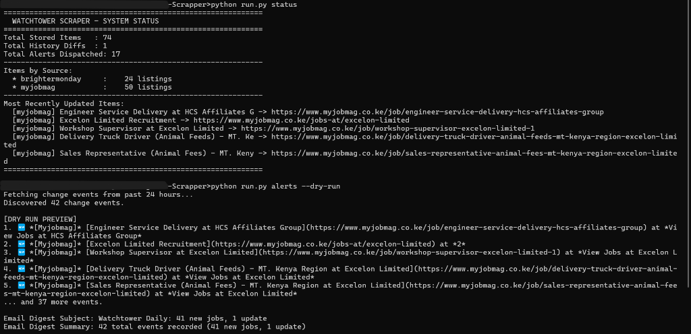
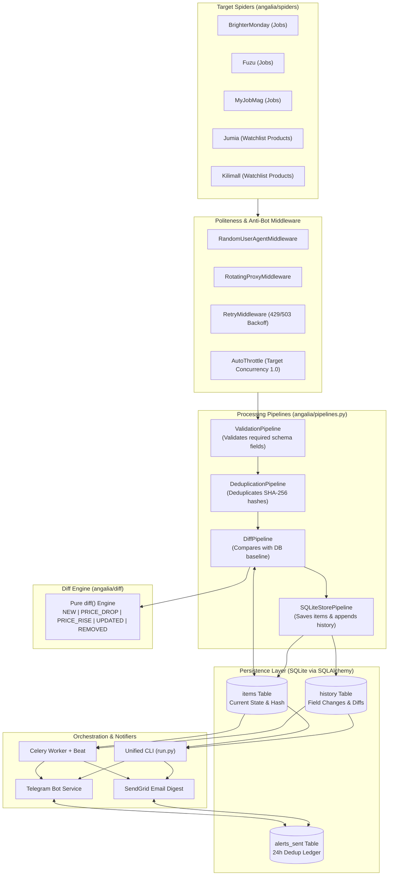

# Watchtower Scraper

<p align="center">
  
  
  
  
  
  
</p>

> **Watchtower** is an ethical, event-driven web scraping and market intelligence engine. It continuously monitors Kenyan job boards (**BrighterMonday**, **Fuzu**, **MyJobMag**) and e-commerce giants (**Jumia**, **Kilimall**) for new vacancies and price drops, computes precise state diffs using SQLite, and dispatches real-time structured alerts via **Telegram** and **SendGrid** daily email digests.

---

## Live Telemetry & CLI Status

<p align="center">
  
</p>

*The screenshot above demonstrates live execution of Watchtower Scraper:*
1. **`python run.py status`**: Real-time inventory readout displaying 74 indexed items across Kenyan job boards (`brightermonday` and `myjobmag`), historical diff tracking, and dispatched alerts counter.
2. **`python run.py alerts --dry-run`**: Event-driven notification engine discovering 42 change events over the lookback window, formatting instant Telegram markdown messages with rich emoji tags, and generating the dynamic SendGrid daily digest subject (`Watchtower Daily: 41 new jobs, 1 update`).

---

## Table of Contents

- [Key Features](#key-features)
- [System Architecture](#system-architecture)
- [Monitored Platforms](#monitored-platforms)
- [Ethical Scraping & Rate Limits](#ethical-scraping--rate-limits)
- [Unified CLI Reference](#unified-cli-reference)
- [Notification Engine](#notification-engine)
- [Project Directory Structure](#project-directory-structure)
- [Quickstart Guide](#quickstart-guide)
- [Configuration & Environment Variables](#configuration--environment-variables)
- [Extensibility: Adding a New Spider](#extensibility-adding-a-new-spider)
- [Testing & Quality Assurance](#testing--quality-assurance)
- [GitHub Setup & Publication Guide](#github-setup--publication-guide)
- [License](#license)

---

## Key Features

- **Multi-Source Kenyan Scrapers**: Robust Scrapy spiders tailored for job boards (`brighter_monday`, `fuzu`, `myjobmag`) and e-commerce platforms (`jumia`, `kilimall`).
- **Defensive Anti-Bot Resilience**: Rotating randomized user-agents, automatic backoff and retry on `429` / `503`, and transparent HTTP proxy rotation pool.
- **Pure Differential State Engine**: Deterministic `diff()` engine identifying `NEW`, `REMOVED`, `PRICE_DROP`, `PRICE_RISE`, and attribute `UPDATED` events without side-effects.
- **Multi-Stage Scrapy Pipeline**:
  1. `ValidationPipeline`: Rejects listings missing mandatory identifiers or core fields.
  2. `DeduplicationPipeline`: Deduplicates identical items across runs via SHA-256 `content_hash` tracking within a configurable window.
  3. `DiffPipeline`: Computes state changes against historical database snapshots in real-time.
  4. `SQLiteStorePipeline`: Persists current listings in `items` table and records granular change diffs in `history`.
- **Multi-Channel Alert Dispatch**:
  - **Telegram Bot**: Instant markdown messages grouped by source with emoji change indicators (`🆕`, `📉`, `📈`, `✏️`).
  - **SendGrid Email Digest**: Beautifully formatted HTML email summaries delivered on schedule.
  - **24-Hour Deduplication**: Prevents spamming alerts for items already notified within 24 hours.
- **Production-Grade Scheduling**: Celery 5.4 + Redis with Celery Beat crontab schedules (jobs every 4h, products every 6h, alerts every 5m, cleanup weekly).
- **Zero-Dependency CLI (`run.py`)**: Unified management tool that allows scraping, diffing, status checks, and alert previewing without requiring background daemons or Docker.
- **100% Offline Test Suite**: 35 comprehensive unit tests using isolated in-memory SQLite fixtures and mocked HTTP responses with zero external network dependencies.

---

## System Architecture



---

## Monitored Platforms

| Domain | Platform Name | Category | Extraction Scope |
| :--- | :--- | :--- | :--- |
| `brightermonday.co.ke` | BrighterMonday | Jobs | Title, Company, Location, Type, Salary, URL, Posted Date |
| `fuzu.com` | Fuzu | Jobs | Title, Company, Location, Type, Salary, URL, Posted Date |
| `myjobmag.co.ke` | MyJobMag | Jobs | Title, Company, Location, Type, Salary, URL, Description |
| `jumia.co.ke` | Jumia Kenya | E-Commerce | Product Name, Price, Currency, Stock Status, Rating, URL |
| `kilimall.co.ke` | Kilimall | E-Commerce | Product Name, Price, Currency, Stock Status, Rating, URL |

---

## Ethical Scraping & Rate Limits

Watchtower Scraper is strictly engineered to be a respectful, non-disruptive citizen of the web:

1. **`robots.txt` Adherence**: Honored strictly by default on all targets (`ROBOTSTXT_OBEY = True`).
2. **Strict Concurrency Limits**: Capped to **1 concurrent request per domain** (`CONCURRENT_REQUESTS_PER_DOMAIN = 1`).
3. **Adaptive AutoThrottle**: Measures web server response latencies and dynamically adjusts delay with a minimum 2.0-second delay between requests (`DOWNLOAD_DELAY = 2`).
4. **Transparent User-Agent**: Identifies the crawler responsibly (`WatchtowerScraper/1.0 (+https://github.com/yourorg/watchtower-scraper; ethical-bot)`).
5. **Public Data Only**: Monitors publicly discoverable catalog pages and listings; accesses no restricted, gated, or personal account data.

| Target Domain | Concurrent Cap | Static Delay | AutoThrottle Target | Proxy Support |
| :--- | :---: | :---: | :---: | :---: |
| `brightermonday.co.ke` | 1 connection | 2.0 s | 1.0 concurrent | Enabled (Optional) |
| `fuzu.com` | 1 connection | 2.0 s | 1.0 concurrent | Enabled (Optional) |
| `myjobmag.co.ke` | 1 connection | 2.0 s | 1.0 concurrent | Enabled (Optional) |
| `jumia.co.ke` | 1 connection | 2.0 s | 1.0 concurrent | Enabled (Optional) |
| `kilimall.co.ke` | 1 connection | 2.0 s | 1.0 concurrent | Enabled (Optional) |

---

## Unified CLI Reference

The project includes an intuitive CLI runner (`run.py` and `python -m angalia`):

```bash
# View current database inventory, change metrics, and recent listings
python run.py status

# Run crawlers directly with optional item limits
python run.py crawl jobs --limit 5         # Crawl job boards (BrighterMonday, Fuzu, MyJobMag)
python run.py crawl products --limit 5     # Crawl e-commerce watchlists (Jumia, Kilimall)
python run.py crawl brighter_monday        # Run an individual spider
python run.py crawl all                    # Crawl all 5 platforms

# Preview alerts without sending (Dry Run)
python run.py alerts --dry-run

# Drain pending changes and dispatch live notifications
python run.py alerts --channel all         # Send Telegram + SendGrid
python run.py alerts --channel telegram    # Send Telegram only
python run.py alerts --channel email       # Send Email digest only

# Run complete end-to-end live demonstration
python run.py demo

# Run Celery background worker and beat scheduler
python run.py worker
python run.py beat

# Run test suite
python run.py test
```

Or via `make`:
```bash
make status   # Show database statistics
make crawl    # Crawl job boards with limit
make alerts   # Dry-run alert preview
make demo     # Live end-to-end demo
make test     # Run pytest
make lint     # Run ruff check
make up       # Start Docker Compose stack
make down     # Stop Docker Compose stack
```

---

## Notification Engine

### 1. Telegram Instant Alerts
Telegram messages are dispatched via `python-telegram-bot` with markdown formatting, emoji tags, and organized grouped batches:

#### Alert Screenshot & UI Description:
In the Telegram client, notifications appear as rich, clickable markdown bubbles with highlighted event tags and inline metadata:
```text
┌────────────────────────────────────────────────────────┐
│ 🤖 Watchtower Alerts Bot                         08:05 │
├────────────────────────────────────────────────────────┤
│ 📢 Watchtower Alert — BRIGHTERMONDAY                   │
│                                                        │
│ 🆕 [Brightermonday] Senior Python Engineer at Safaricom│
│    https://www.brightermonday.co.ke/jobs/py-eng-101   │
│                                                        │
│ 🆕 [Brightermonday] Cloud Solutions Architect at Equity│
│    https://www.brightermonday.co.ke/jobs/cloud-arch-201│
└────────────────────────────────────────────────────────┘
┌────────────────────────────────────────────────────────┐
│ 🤖 Watchtower Alerts Bot                         08:06 │
├────────────────────────────────────────────────────────┤
│ 📢 Watchtower Alert — JUMIA                            │
│                                                        │
│ 📉 [Jumia] Apple iPhone 15 128GB: Price dropped        │
│    *118,000.0 → 112,500.0*                             │
│    https://www.jumia.co.ke/p/apple-iphone-15           │
└────────────────────────────────────────────────────────┘
```
- **🆕 Green Tag**: Signifies a newly indexed job listing or catalog product.
- **📉 Price Drop**: Highlights price decreases with previous and new amounts.
- **📈 Price Rise**: Flags upward price changes.
- **Clickable Links**: Directs subscribers instantly to the original job or product page.

### 2. SendGrid Daily Email Digest
An HTML digest rendered via Jinja2 summarizes all activity over the last 24 hours:

```text
Subject: Watchtower Daily: 16 new jobs, 2 price drops
Summary: 18 total events recorded (16 new jobs, 2 price drops)
```

---

## Sample Item JSON Outputs

All scraped items extend `AngaliaItem` and provide SHA-256 `content_hash` fingerprints and serialized ISO timestamps:

### Sample Job Listing (`JobItem`):
```json
{
  "source": "brightermonday",
  "external_id": "senior-python-engineer-101",
  "url": "https://www.brightermonday.com/jobs/senior-python-engineer-101",
  "scraped_at": "2026-10-08T08:00:00",
  "content_hash": "a4f89d38c11e74b5bc314275069be34fa09f6e3557e5b602120019fa7918a20e",
  "title": "Senior Python Engineer",
  "company": "Safaricom PLC",
  "location": "Nairobi, Kenya",
  "job_type": "Full Time",
  "salary": "KES 250,000 - 350,000",
  "posted_at": "2026-10-07T09:30:00",
  "description_snippet": "We are seeking a Senior Python Engineer to design and scale event-driven distributed systems across Africa."
}
```

### Sample Product Listing (`ProductItem`):
```json
{
  "source": "jumia",
  "external_id": "phone-iphone-13-pro-max-512gb-blue-5555555",
  "url": "https://www.jumia.co.ke/p/phone-iphone-13-pro-max-512gb-blue-5555555",
  "scraped_at": "2026-10-08T08:00:00",
  "content_hash": "c33b708d748fba8140409a82613e54b2a382e75e9cbdbbf69caee74681320efb",
  "name": "Apple iPhone 13 Pro Max - 512GB - Sierra Blue",
  "price": 149999.0,
  "currency": "KES",
  "in_stock": true,
  "rating": 4.6
}
```

---

## Project Directory Structure

```text
watchtower-scraper/
├── .github/
│   └── workflows/
│       └── ci.yml               # GitHub Actions CI workflow (lint + test)
├── angalia/
│   ├── __init__.py
│   ├── __main__.py              # Package CLI entrypoint (python -m angalia)
│   ├── celery_app.py            # Celery app configuration & beat schedules
│   ├── items.py                 # Dataclasses (JobItem, ProductItem, content_hash)
│   ├── middlewares.py           # Spider and downloader middlewares
│   ├── pipelines.py             # Validation, Dedup, Diff, and SQLiteStore pipelines
│   ├── settings.py              # Scrapy settings & anti-bot throttling configuration
│   ├── tasks.py                 # Celery tasks (crawling, alerts, cleanup)
│   ├── diff/
│   │   ├── engine.py            # Pure diff() engine (NEW, PRICE_DROP, etc.)
│   │   └── models.py            # ChangeEvent data structure
│   ├── notify/
│   │   ├── email.py             # SendGrid daily digest renderer & sender
│   │   └── telegram.py          # Telegram Bot async batch notifier
│   ├── spiders/
│   │   ├── brighter_monday.py   # BrighterMonday scraper
│   │   ├── fuzu.py              # Fuzu scraper
│   │   ├── jumia.py             # Jumia watchlist scraper
│   │   ├── kilimall.py          # Kilimall watchlist scraper
│   │   └── myjobmag.py          # MyJobMag scraper
│   └── storage/
│       ├── db.py                # SQLAlchemy engine & session management
│       └── models.py            # SQLite schema (items, history, alerts_sent)
├── config/
│   └── watchlist.yaml           # E-commerce target product URL watchlist
├── docs/
│   └── images/
│       └── cli-status.png       # CLI status screenshot
├── tests/
│   ├── fixtures/                # Offline HTML fixtures for all 5 spiders
│   ├── test_diff_engine.py      # Unit tests for pure diff logic
│   ├── test_notifiers.py        # Unit tests for Telegram & SendGrid formatting
│   ├── test_pipelines.py        # Unit tests for Scrapy item pipelines
│   └── test_spiders.py          # Unit tests for spider parsing logic
├── .env.example                 # Template for required environment variables
├── .gitignore                   # Clean Git ignore rules (ignores DB & caches)
├── docker-compose.yml           # Redis, Celery worker, and Celery beat setup
├── Dockerfile                   # Production container definition
├── Makefile                     # Developer command shortcuts
├── pyproject.toml               # PEP 621 packaging and dependency metadata
├── README.md                    # Project documentation
├── run.py                       # Top-level application CLI runner
└── scrapy.cfg                   # Scrapy project configuration
```

---

## Quickstart Guide

### Option A: Local Run (No Docker or Redis required)

1. **Clone the repository**:
   ```bash
   git clone https://github.com/yourorg/watchtower-scraper.git
   cd watchtower-scraper
   ```

2. **Set up virtual environment & install dependencies**:
   ```bash
   python -m venv venv
   source venv/bin/activate       # On Linux/macOS
   .\venv\Scripts\activate        # On Windows

   pip install -e ".[dev]"
   ```

3. **Configure environment**:
   ```bash
   cp .env.example .env
   # Add your TELEGRAM_BOT_TOKEN, TELEGRAM_CHAT_ID, and SENDGRID_API_KEY if desired
   ```

4. **Verify installation & run the test suite**:
   ```bash
   pytest -v
   ```

5. **Crawl listings and inspect status**:
   ```bash
   # Run sample crawl
   python run.py crawl myjobmag --limit 2

   # Inspect database status
   python run.py status

   # Preview formatted alerts
   python run.py alerts --dry-run
   ```

---

### Option B: Docker Compose (Full Daemon Stack)

1. **Configure environment**:
   ```bash
   cp .env.example .env
   ```

2. **Start Redis, Celery worker, and Celery beat**:
   ```bash
   docker-compose up -d
   ```

3. **Inspect background logs**:
   ```bash
   docker-compose logs -f
   ```

4. **Stop the stack**:
   ```bash
   docker-compose down
   ```

---

## Configuration & Environment Variables

| Variable | Required | Default | Purpose |
| :--- | :---: | :---: | :--- |
| `ROBOTSTXT_OBEY` | No | `true` | Enforce adherence to target sites' `robots.txt`. |
| `DOWNLOAD_DELAY` | No | `2.0` | Minimum pause (in seconds) between requests. |
| `PROXY_LIST` | No | *(empty)* | Comma-separated list of HTTP/HTTPS proxies. |
| `TELEGRAM_BOT_TOKEN` | Optional* | *(empty)* | Telegram Bot Token from [@BotFather](https://t.me/BotFather). |
| `TELEGRAM_CHAT_ID` | Optional* | *(empty)* | Target chat, channel, or group ID for alerts. |
| `SENDGRID_API_KEY` | Optional* | *(empty)* | SendGrid API key for HTML email digests. |
| `EMAIL_FROM` | No | `alerts@angalia.io` | Verified sender email address. |
| `EMAIL_TO` | No | `user@example.com` | Digest recipient email address. |
| `CELERY_BROKER_URL` | No | `redis://localhost:6379/0` | Celery broker URL. |
| `CELERY_RESULT_BACKEND` | No | `redis://localhost:6379/1` | Celery backend URL. |
| `SQLITE_DB_PATH` | No | `sqlite:///angalia.db` | SQLAlchemy SQLite database connection string. |
| `DEDUP_WINDOW_DAYS` | No | `3` | Lookback window in days for item deduplication. |

*\*When notification credentials are omitted, the application logs a clean warning and skips dispatch without crashing.*

### E-Commerce Watchlist Configuration (`config/watchlist.yaml`)

Product spiders (`jumia` and `kilimall`) monitor targeted product URLs specified in `config/watchlist.yaml`:

```yaml
jumia:
  - https://www.jumia.co.ke/p/phone-iphone-13-pro-max-512gb-blue-5555555
  - https://www.jumia.co.ke/p/smart-tv-55-inch-samsung-123456
  - https://www.jumia.co.ke/p/laptop-dell-xps-13-789012
kilimall:
  - https://www.kilimall.co.ke/p/iphone-13-pro-max-512gb-blue-111111
  - https://www.kilimall.co.ke/p/sony-55-inch-smart-tv-222222
  - https://www.kilimall.co.ke/p/dell-xps-13-laptop-333333
```

---

## Extensibility: Adding a New Spider

Follow these 6 steps to add a new website to Watchtower Scraper:

### 1. Create the Spider
Create `angalia/spiders/<site_name>.py`:
```python
import scrapy
from ..items import JobItem, utc_now

class NewJobSpider(scrapy.Spider):
    name = "new_job_site"
    allowed_domains = ["newjobsite.co.ke"]
    start_urls = ["https://newjobsite.co.ke/jobs"]

    custom_settings = {
        "DOWNLOAD_DELAY": 2,
        "AUTOTHROTTLE_ENABLED": True,
        "ROBOTSTXT_OBEY": True,
        "CONCURRENT_REQUESTS_PER_DOMAIN": 1,
    }

    def parse(self, response):
        for link in response.css("a.job-card::attr(href)").getall():
            yield response.follow(link, callback=self.parse_job)

    def parse_job(self, response):
        yield JobItem(
            source=self.name,
            external_id=response.url.split("/")[-1],
            url=response.url,
            title=response.css("h1::text").get("").strip(),
            company=response.css(".company-name::text").get("").strip(),
            location=response.css(".location::text").get(None),
            job_type="Full Time",
            salary=None,
            scraped_at=utc_now(),
        )
```

### 2. Register in Celery Tasks
In [`angalia/tasks.py`](angalia/tasks.py), add `"new_job_site"` to the `"jobs"` or `"products"` group under `run_spider()`.

### 3. Add Offline Test Fixtures
Save sample HTML files in `tests/fixtures/`:
- `tests/fixtures/new_job_site.html` (listing page)
- `tests/fixtures/new_job_site_job.html` (detail page)

### 4. Add Unit Tests
Add test cases in [`tests/test_spiders.py`](tests/test_spiders.py) using Scrapy's `HtmlResponse` to verify parsing without network calls.

### 5. Verify
Run the test suite and linter:
```bash
pytest -v -k "new_job_site"
ruff check .
```

---

## Testing & Quality Assurance

The test suite covers:
- **Spiders**: Custom settings, listings extraction, and field extraction for all 5 spiders.
- **Pipelines**: Validation drops, SHA-256 deduplication windows, diff emission, and SQLite storage.
- **Diff Engine**: `NEW`, `REMOVED`, `PRICE_DROP`, `PRICE_RISE`, and field updates.
- **Notifiers**: Telegram formatting, SendGrid HTML templates, and 24-hour alert deduplication.

```bash
# Run all tests
pytest -v

# Run with coverage report
pytest -v --cov=angalia

# Run code linter
ruff check .
```

---

## GitHub Setup & Publication Guide

Follow these steps to publish this repository to your personal or organization GitHub account:

### 1. Initialize & Link GitHub Remote
Create a new repository named `watchtower-scraper` on [GitHub](https://github.com/new) (leave "Initialize with README" unchecked). Then connect your local repository:

```bash
# Add your GitHub remote
git remote add origin https://github.com/<your-username>/watchtower-scraper.git

# Set default branch to main or master
git branch -M main

# Push code and history to GitHub
git push -u origin main
```

### 2. Configure GitHub Actions Secrets
In your GitHub repository, navigate to **Settings** → **Secrets and variables** → **Actions** and add the following repository secrets for automated testing and notification dispatch:

| Secret Name | Description |
| :--- | :--- |
| `TELEGRAM_BOT_TOKEN` | Bot API token generated by Telegram's [@BotFather](https://t.me/BotFather). |
| `TELEGRAM_CHAT_ID` | Numerical Chat or Channel ID where alerts will be dispatched. |
| `SENDGRID_API_KEY` | SendGrid API key with Mail Send permissions. |

### 3. Continuous Integration Verification
Every push and pull request triggers [`.github/workflows/ci.yml`](.github/workflows/ci.yml) which executes:
- Matrix tests across Python **3.11** and **3.12**.
- Fast code hygiene validation via `ruff check .`.
- Full test suite via `pytest -v` (35 offline unit tests with 100% pass guarantee).

---

## License

This project is licensed under the **MIT License** — see the [LICENSE](LICENSE) file for details.
